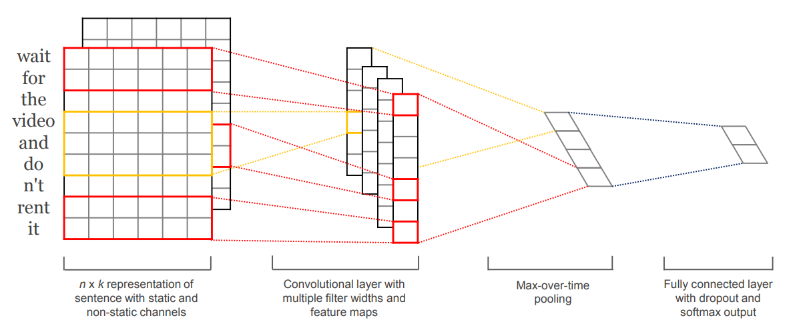

## Hiring test for Mainspring
### SARA Comments classification

#### Solution:
- Pre-processing:
    - Tokenize sentence to words list
    - Filter Indonesian stopwords
    - Filter English stopwords
    - Filter non-alphabet characters and punctuation

- Word Embedding: Using Word2Vec to vectorize sentence:
    - Train a Word2Vec model on all sentences in train and test set
    - Pad sentence to have same length (length of the longest sentence after pre-processed)
    - Each sentence after vectorizing is a tensor size ```max_lenX300```

- Model:[CNN model](https://arxiv.org/pdf/1408.5882.pdf) for sentences classification
    - 
- Performance:
    - Parameters: 
        - Learning rate: 0.01
        - Optimizer SGD with momentum: 0.9
        - Batch size: 64, epochs: 250
        - Save the model which provide the highest validation accuracy
    - Training: Get the best result at epoch 29-th:
        ```
           Epoch: 29 || Train Loss: 0.004787 
           Epoch: 29 || Val Loss: 0.074392 || Val Acc: 0.876
        ```
    - Testing:
        ```
        Acc: 85.635% || Precision: 0.916 || Recall: 0.567 || F1-score: 0.701
        ```

#### Installation:
- Environment:
    - OS: Linux
    - Anaconda, Python 3.6 
- Install libaries and depedencies:
    - ```pip intall -r requirements.txt```
- Pre-trained weight file:
    - Download [here](https://drive.google.com/file/d/1Q-XWxQndD6mb8hDS6LTtRTtXm8RC0CpO/view?usp=sharing)!
    - Move the downloaded file to ```weights``` folder
- Install nltk:
    - ``` python install_nltk.py```
- Download ```data.zip``` file and unzip in project folder
#### Usage:
- Generate train,test,val sets:
    - ```python raw_data_process.py```
- Train, extract Word2Vec model:
    - ```python -m word_embedding.word2vec```
- Train model:
    - ```python train.py```
    - Run: ```python train.py --help``` for more options
- Test model:
    - ```python test.py```